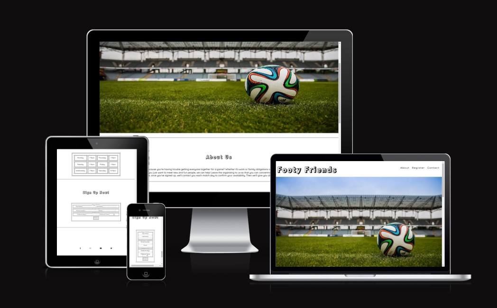

# Footy Friends

This site aims to give people who love football the opportunity to play a game whenever they wish. It is targeted towards people who have busy schedules, who find it difficult to find or arrange a game, or people who want to widen their circle of like-minded friends.  It will be a useful site as it will take all of the work out of organising and coordinating a game and allow them to simlply look forward to and enjoy the match.

## Features

- **Navigation**

    - Featured on the top of the page the navigation bar has the site title in the top left hand corner.
    - There are three navigation links in the top right hand corner which link to corresponding areas of the webpage.
    - The font is in a clearly contrasting color to the site background and turns green when hovered over with the mouse. This will make it easier for the user to locate and navigate to the desired area.

- **The Header Image**

    - This image is eye-cathing and included to illustrate the sport the site pertains to and to excite the user.

- **The About Us Section**

    - The About Us section proposes examples of instances in which this site would be beneficial to the user.
    
    - The section explains how to avail of the service, the procedure going forward and provides the cost.

- **The When Section**

    - The When section includes a table with a list of days in the week and the corresponding period of time that games are available to book within.
    
    - The table gives the user information which will allow them to decided if this service will work around their schedule.
    
    - This section was included as folow-on from the About Us section, relevant only if the users interested is piqued after reading the preceding section. As such no direct link was included in the navigation bar.

- **The Sign Up Now!**

    - The Sign Up Now! section has a form for the user to fill out when they decide to use the service.

    - They provide their first and last names, email address and contact number, preferred days and times to play.

    - The form is valuable to the user as it will allow them to register with the site and to state their personal preferences regarding the service.

 

- **The Footer**

    - The Footer contains the contact links to external social media accounts which will contain further contact information and allow the user to make enquiries or gather further information about the service offered.

    - The section includes well-known icons as links to Facebook, Instagram, Youtube and Twitter.

## Testing

- Site was opened on multiple browsers - Chrome, Firefox and Microsoft Edge.

- Responsiveness was tested using Devtools

- All of the navigation links work fully in both the navigation section in the header and in the footer

- The form works fully in that it will only submit when all of the required fields are filled out with the appropriate information type

## Validator Testing

- No errors or warnings to show when tested in the official W3C validator - HTML

- No errors or warnings to show when tested in the official jigsaw W3C validator - CSS

- Fonts and colors are good and site accessible as confirmed by Lighthouse

## Bugs

   - There are no bugs

## Deployment

   - Site deployed to GitHub pages by the following steps:

     - Go Github repository

     - Open settings

     - Go to Pages

     - From the Source drop-down menu select to deploy from a branch

     - From the branch drop-down menu select main

     - Click Save and the site link to the website is provided

The live link is here: [Footy Friends](https://ger-23.github.io/footy_friends/)

## Credits

   - Content
     
     - The code for the navigation in the header was influenced by the Love Running Project

     - Google and W3C tutorial provided helpful information for developing the site

   - Media
     
     - Main image was taken from Pexels.com

     - Social media link icons were taken from Font Awesome

     - Font styles were take from Google Fonts
